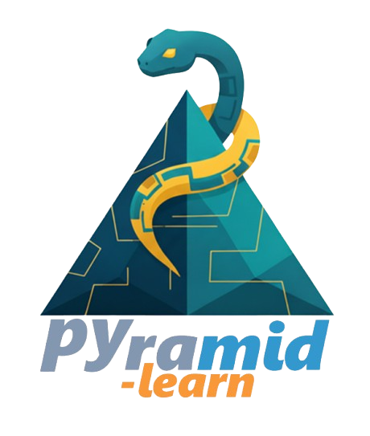

<!-- README.md -->

# pyramid-learn 

A Python wrapper for the 'midr' R package to explain black-box models, with a scikit-learn compatible API.

The goal of 'midr' and 'pyramid-learn' is to provide a model-agnostic
method for interpreting and explaining black-box predictive models by
creating a globally interpretable surrogate model. The package implements
'Maximum Interpretation Decomposition' (MID), a functional decomposition
technique that finds an optimal additive approximation of the original
model. This approximation is achieved by minimizing the squared error
between the predictions of the black-box model and the surrogate model.
The theoretical foundations of MID are described in Iwasawa & Matsumori
(2025) \[Forthcoming\], and the package itself is detailed in [Asashiba
et al. (2025)](https://arxiv.org/abs/2506.08338).

## Installation

You can install the package directly from GitHub:

```bash
pip install git+https://github.com/ryo-asashi/pyramid-learn.git
